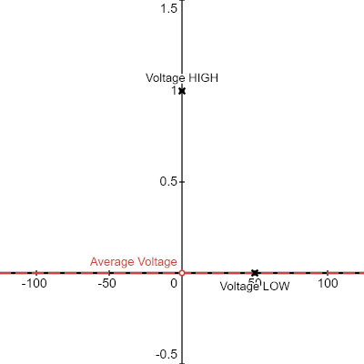
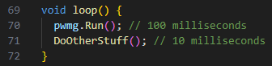
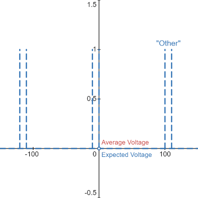
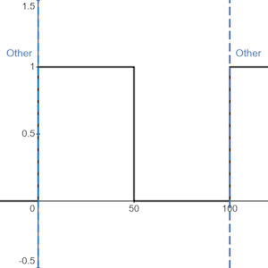
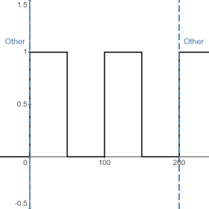
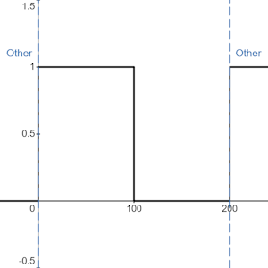

# pwm-generator

This is a library designed to create analog output with Arduino-compatible microcontrollers.

* Enables non-PWM pins (digital only) to output custom analog voltages

* Should work on any microcontroller with Arduino (``<Arduino.h>``) support

* Can theoretically be as precise and accurate as you need it to be with proper configuration and testing

* Tested on my ESP32 for verification

# Installation

## Submodule, VSCode/PlatformIO

1. Navigate to your project directory in terminal \
``cd "project_directory"``

2. Add the repository as a submodule in your ``lib`` folder \
``git submodule add https://github.com/MicJagger/pwm-generator.git lib/pwm-generator``

3. In your project files, add ``include <pwm-generator.hpp>`` at the top of every file you need functionality

4. Whenever you flash your program, the library will automatically link, compile, and transfer

Things to keep in mind:

* Whenever you clone you repository, ensure you do ``git clone "URL" --recursive``

* To update submodules, run ``git submodule update --init --recursive`` from within the project directory

## Arduino IDE

WIP (I don't use it, will fill in later)

# Documentation

This section is up to date to version 2.1.0.

## Explanation

PWM, or pulse-width modulation, is a method of achieving various levels of voltage with an output method of only using HIGHs and LOWs, or 1 and 0.

By rapidly switching on and off, it is able to achieve a voltage depending on the fraction of the time that is is on, as well as the reference voltage.

In other words, the percentage of the time that the output is on equals the percentage of the output's voltage that is perceived.

[.gif Credit to Desmos](https://www.desmos.com/calculator/hnhb191rn9)

Many microcontrollers will have 3.3V outputs, so having a PWM signal with a duty cycle of 50% (on for half and off for half) will yield roughly 1.65V.

However, when writing this in software rather than using an extra pwm chip, there is a caveat.

Whenever the processor finishes a cycle of pulses, there will always be some amount of time in between for loop and usually function overhead, as well as any other functions if this is kept in a loop with other code.

Let's say that your overall pulse cycle takes 100 milliseconds, and you have 10 milliseconds of other work to do (reading inputs, etc).

### Then there are some skewing issues.

If our PWM-generating function were to default to LOW between pulses, then that would look like this.

[My modifications of the same Desmos graph](https://www.desmos.com/calculator/hnhb191rn9)

And if it were to default the pin to HIGH between pulses, then that would look like this.

[My other modifications of the same Desmos graph](https://www.desmos.com/calculator/hnhb191rn9)

Notice the gaps in voltage versus expected voltage, especially when it defaults to HIGH as you get to lower duty cycles.

These are what I am referring to as ``skew`` in the code, which is whether the output pin defaults to HIGH or LOW between its sets of toggling on and off.

(Note: This does not apply to values of exactly 0% or 100% duty cycle due to the implementation, which the graphs reflect)

The biggest challenge is not only accounting for a zone in the middle, which can be planned around by compensating on the duty cycle, but if that zone is variable in length. If you cannot predict the time inbetween pulses, you cannot predict your duty cycle, which in turn means your voltage is unreliable.

### Due to this potentially variable zone inbetween pulses, there are many effects to be aware of.

Whenever you do other work on the same core, that is processing time that the Run() function is not doing periodic, controlled pulses.

This includes any other code whatsoever, but also changing values. When you change a voltage setting, it puts the pin and value you set into a queue. This makes it so that whenever the Run() function finishes a loop, it runs through this queue and adds the new values. If you are changing values frequently (milliseconds), this will potentially destabilize your voltages by increasing the gap time.

### How do we remedy this?

Try to minimize the amount of work that the processor has to do between pulses. If your microcontroller has more than one core, it is highly recommended to give this function its own core, and run everything else on the other(s).

If you cannot minimize the time other processes have, then increasing the amount of time the pulse code runs for will increase the percentage of the time that it is running compared to everything else.

Any way that you can normalize the amount of time the PWM generator is not in control, the more consistent its voltage is.

Any way that you can reduce the amount of time the PWM generator is not in control, the more accurate its voltage is.

There are also many other settings you can change to experiment if the voltage is not where you want it to be.

I have done lots of experimentation, and found that on my ESP32 with the Run() function pinned to core 1, that my most accurate consistent settings are 

``cycleCount = 4``, 

``cycleLengthExtension = 8``, and 

``skew = LOW``.

As such, these are the defaults.

However, the higher percentage of your pins that you change at once, the more this will vary, as it is increasing the time it takes for the queue to insert into the main data structure for running the pulses.

If you are also trying to run a low voltage with HIGH skew, that is easily the most unreliable range, as the percentage of the additional HIGH time is the greatest, which is visible on the ``skew = HIGH`` graph.

## Functions

### void SetVoltage(uint8_t pin, uint16_t value);

Takes in the pin number and the duty value you would like to use. This operates as a fraction of the max duty value, with 0 being 0 V and maxDutyValue being reference voltage (usually ~3.3V).

For example, ``SetVoltage(18, 127)`` would make something similar to this (using default max duty value and 1 for the cycle settings):

### void SetCycleCount(uint16_t cycleCount);

Increases the number of cycles that are executed in each execution of Run().

Taking the example from SetVoltage, if we increased cycleCount from 1 to 2:

default = 4 (cycles)

### void SetCycleLengthExtension(uint16_t cycleLengthExtension);

Adds a pulse length extension of n microseconds (will possibly refactor to SetPulseLengthExtension).

Not recommended to set to 0.

Taking the example from SetVoltage, if we doubled the value of cycleLengthExtension (say from 1 to 2):

(Notice the scaling)

default = 8 (microseconds)

### void SetMaxDutyValue(uint16_t maxDutyValue)

Sets the number of voltage levels, allowing variable precision in voltage settings.

For example, SetVoltage of value 30 with SetMaxDutyValue(120) means voltage is 30/120 * Vref (or Vref / 4).

default = 255 (levels)

### void SetSkew(bool skew);

Changes the [aforementioned and depicted skew value](#then-there-are-some-skewing-issues), which is the value that is held inbetween pulsing periods.

default = LOW

### void Run()

The main function, which pulses the signals. Run this in loop() by itself, or pin RunLoop() to its own core.

First adds the insertionQueue to the analogPins structure, then enables and disables them in tandem for some amount of time dependent on pin count, cycleCount, and cycleLengthExtension.

Depending on skew, either starts pins LOW and ends HIGH, or starts pins HIGH and ends LOW.

### void RunLoop()

This is just Run() inside a while loop.

CAUTION: THIS DOES NOT TERMINATE ITSELF.

## Known Issues

### Crashing due to Watchdog Timer

Devices like these have a watchdog timer, which ensures no task has been running for too long, especially on important cores.

On my ESP32, if I pin Run()/RunLoop() to core 0, it *will* crash the microcontroller after seconds.

Disabling watchdog is a bad idea, and so my optimal solution is to simply put Run() in loop(), or to pin RunLoop() to core 1 and fill loop() with a delay(10000);

Depending on your microcontroller and your OS, this may vary for you, and it may cause you problems.

### Pausing when shutting down VSCode

If the device is plugged into your computer and hooked up to the Serial output, I have noticed the device ceasing to apply voltages correctly if close VSCode. Disconnecting and reconnecting fixes this issue.

### Setting cycleCount, cycleLengthExtension, and/or maxDutyValue too high

Since all of these increase the length of time Run() is running for, it can have numerous unexpected consequences in your code

It could trigger watchdog timer, or make something else time-sensitive not get to function

They have practical limits, but I have chosen to leave it open to the user to set whatever values they want, because who knows, it might be useful

## Other

